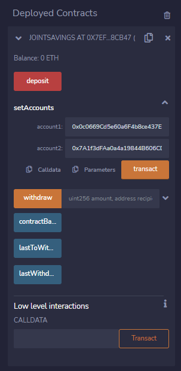
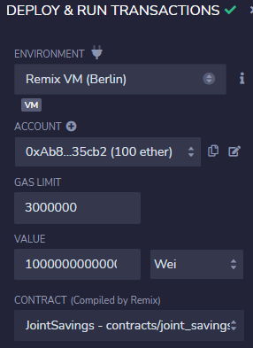
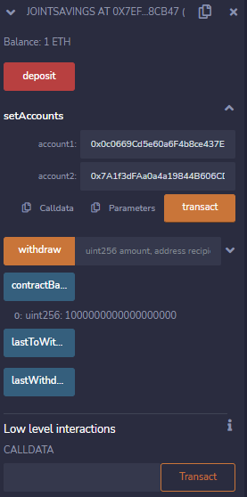
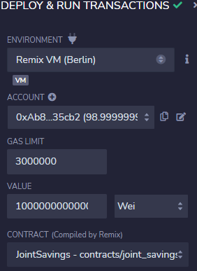
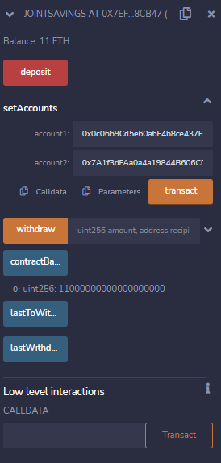
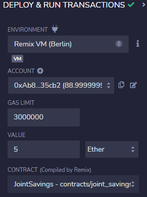
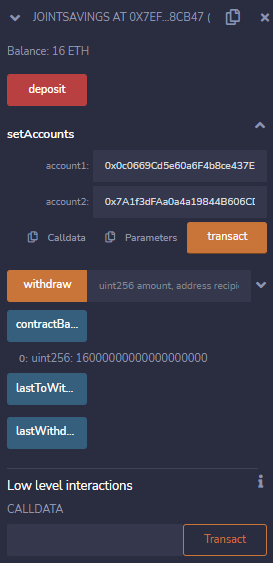
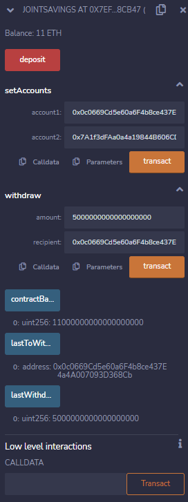
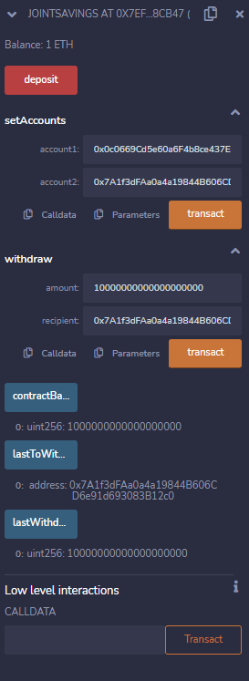

# solidity-joint-account

## Background

 

For this module challenge, we will be using smart contracts to automate the creation of savings accounts. The smart contract we create will accept two user addresses with both of them being able to control the joint savings account.

 

## Deplot and Assign User Accounts

 

After creating and compiling our joint_savings.sol smart contract we are then able to deploy the contract in the remix test environment (JavaScript VM).

The first step after deploying would be to assign addresses to the two accounts. This can be seen in the first screenshot below.

 

 

## Transaction 1 - Send 1 ether as wei
 
For the first transaction, we send 1 ether (as wei) from one of the dummy wallets in the test environment (JavaScript VM). The screenshot below shows the wallet we are sending the ether from.

 

 

The screenshot show that the ether has indeed gone to our smart contract, with the account balance now at 1 ether.

 

 

## Transaction 2 - Send 10 ether as wei
 
For the second transaction, we send 10 ether (as wei) from one of the dummy wallets in the test environment (JavaScript VM). The screenshot below shows the wallet we are sending the ether from.

 

 

The screenshot show that the ether has indeed gone to our smart contract, with the account balance now at 11 ether.

 

 

## Transaction 3 - Send 5 ether
 
For the third transaction, we send 5 ether from one of the dummy wallets in the test environment (JavaScript VM). The screenshot below shows the wallet we are sending the ether from.

 

 

The screenshot show that the ether has indeed gone to our smart contract, with the account balanc now at 16 ether.

 

 

## Send 5 Ether to Account 1
 
To test the withdrawal of funds we will send 5 ether to the account 1. We can see from the screenshot below that the smart contract accounts's balance drops to 11 ether, with the amount withdrawn at 5 ether and the last to withdraw being account 1.

 

 

## Send 10 Ether to Account 2
 
To test the withdrawal of funds again we will send 10 ether to the account 2. We can see from the screenshot below that the smart contract accounts's balance drops to 1 ether, with the amount withdrawn at 10 ether and the last to withdraw being account 2.

 

